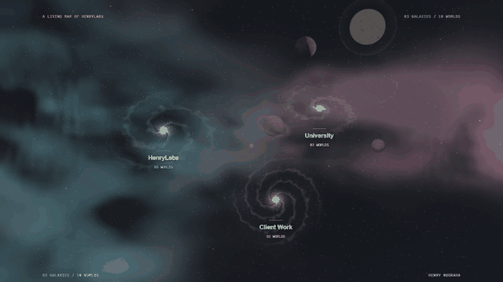
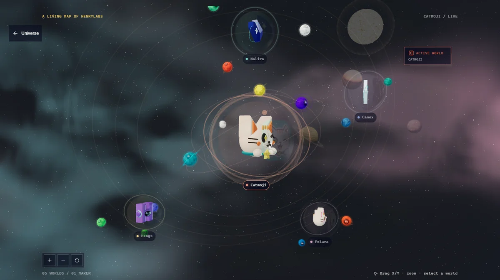
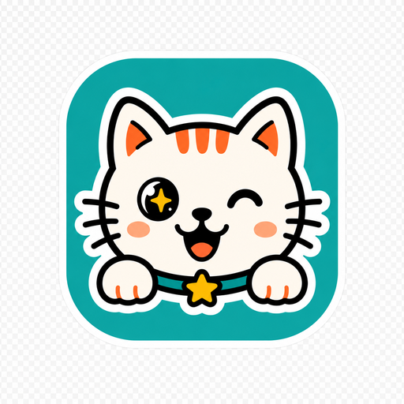
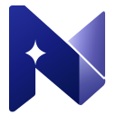
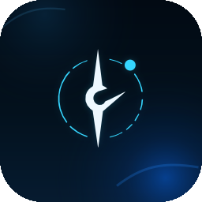
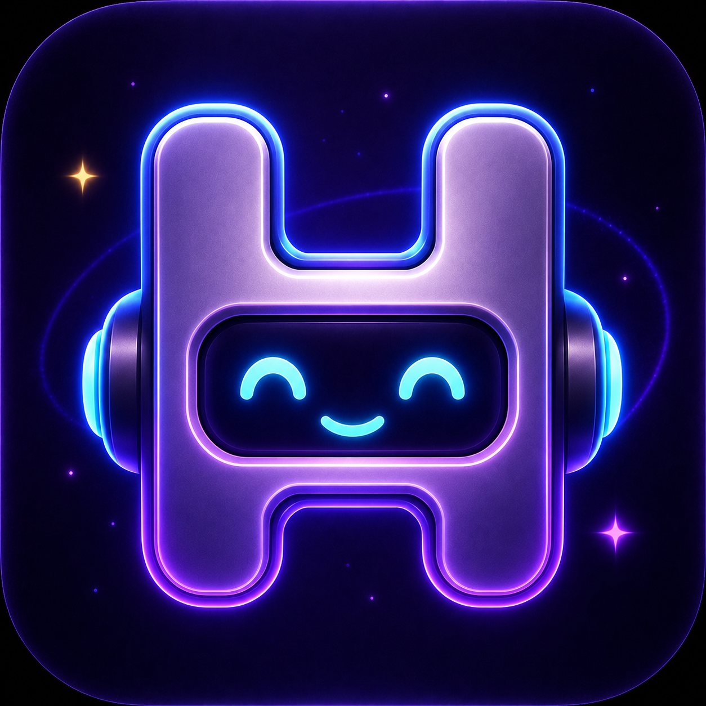
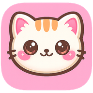
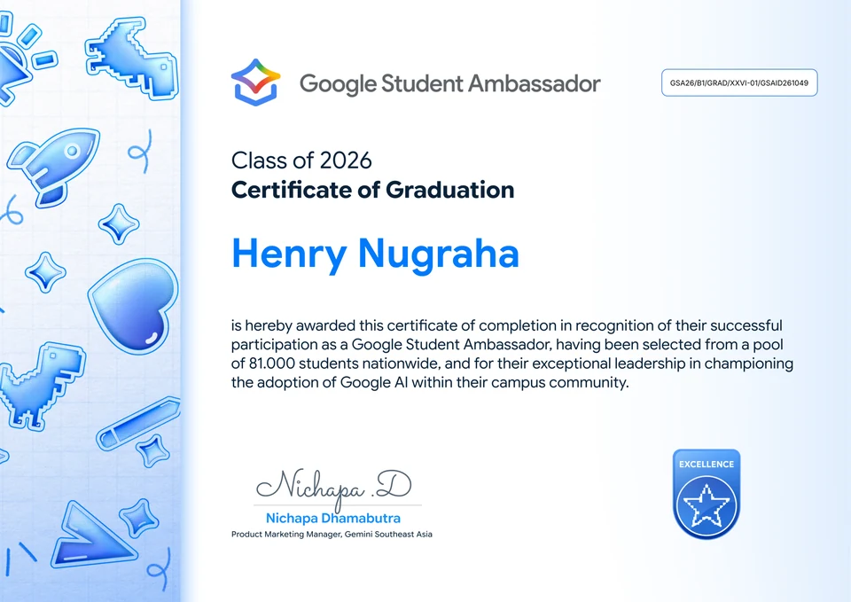
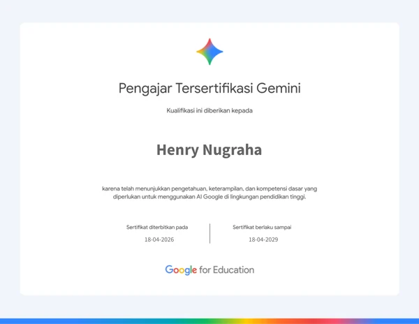
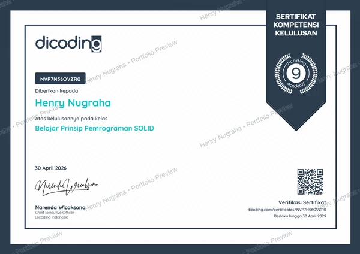

<div align="center">

# StarGod Portfolio v0.95.0

**I build things I actually see.**

<picture>
  <source media="(prefers-reduced-motion: reduce)" srcset="public/assets/readme/universe-poster.webp" />
  <source type="image/webp" srcset="public/assets/readme/living-universe.webp" />
  
</picture>

**StarGod** is Henry Nugraha's universe of products, client systems, and things built while learning.
Designed and developed by **Henry Nugraha**, a product-minded developer in Indonesia.

[The Worlds](#the-worlds) · [University](#university) · [Client Work](#client-work) · [Credentials](#credentials) · [Contact](#contact)

[View the still image](public/assets/readme/universe-poster.webp)

</div>

## The Experience

Three galaxies. Ten project worlds. One maker.

The living map is backed by a procedural volumetric nebula: layered filaments, distant stellar depth, and a slow parallax drift keep the sky feeling like space rather than a flat backdrop while the project systems remain readable.

StarGod is the working name of the universe, drawn from Henry's longtime alias. **HenryLabs** remains its personal-project galaxy. An authored stellar-orbit mark connects the header, quiet entrance, maker signature, and footer.

Enter a living map of **HenryLabs**, **University**, and **Client Work**. Choose a galaxy, follow a curved camera approach into its planets, and explore the work behind each identity. The active galaxy and planet keep a restrained halo, readable label, and selected state while pointer and keyboard focus reveal the same target. The camera eases through a moving focus point when changing sectors, so the scene does not jump to a new center. Returning retraces that journey without rebuilding the scene. Explore the universe lands in a stable, fully visible exploration window, with space to browse before the camera recedes. The opening headline stays free of project overlays when scrolling back up. Technologies orbit the projects they belong to; an optional reading panel shares the same layout across all ten worlds, with context, ownership, workflow, and technology. It stays closed until requested. Read a project in detail or close the panel to return to the orbit, with keyboard focus preserved throughout.

Beyond the map: one preview following the selected project, then Henry himself. The selected world hands off through a small worldline marker before its clearly labeled artwork preview opens large, zooms, pans, and returns to the reading flow without pretending artwork is an app screenshot. The preview media and facts arrive with a restrained depth offset, then a quiet orbit signal carries the eye toward the maker chapter. A crowned StarGod portrait opens locally under the cursor to reveal Henry in a dark suit: sunglasses, clear glasses, then his unobscured face. The approved portraits share one composition; this is a layered photographic reveal, not a rotatable head model. Four appearance controls also work with touch, keyboard, or reduced motion.

Twenty-five technologies surround the portrait as lit 3D satellites. Scroll through **Build, Interface, Systems, then All**, or choose a group directly. Two restrained orbital traces make the shared system legible without turning it into a web of connections. Drag left or right to turn the orbit with momentum; arrow controls offer the same motion without dragging. Tools pass in front of and behind Henry with depth-aware contrast and larger touch targets; select one to see the projects that use it. Scroll further and the orbit recedes earlier, while the five featured credentials arrive together with a longer reading hold around the same anchored figure. A thin horizon signal leads that exchange before the credential cards settle. Each credential can open in the shared watermarked viewer. This exchange also works in tablet and phone windows. Short landscape screens and reduced motion retain a readable sequence. Home no longer repeats a separate technology chapter and certificate shelf; the full collections live in their own libraries.

A continuous Three.js universe connects the journey, from distant stars and nebulae to a reversible black-hole encounter at Contact. Natural background planets remain in orbit throughout the reading sections, moving into a smaller peripheral composition rather than disappearing. A metallic UFO and its pursuing scout add a small story along the way: banking through real depth, missed tracer shots, a luminous wormhole, the UFO entering first, and the scout following. After the portal closes, thirty quiet seconds pass before the next encounter. The scene pauses outside its clear flight areas and respects reduced motion.

Prefer a closer read? **Projects** opens a searchable catalog of all ten worlds, filtered by HenryLabs, University, or Client Work. Each planet and catalog record leads to the same project detail, with ownership, workflow, stack, and honest access boundaries. Continue to the previous or next project within the same galaxy or filtered selection, or return to the universe from that planet; its reading panel stays closed until requested.

**Credentials** is a separate library of all 26 learning records. Filter by issuer or type, search a title, and open a full-size watermarked preview with zoom and available PDF previews. Browse the current selection without closing the viewer; Home keeps its gallery limited to the five featured records. Arrow keys move between documents at fitted size and pan the image when zoomed. A small preview remains visible while the full-size image loads, with a retry option on failure. English/Indonesian and motion choices travel with the internal links.

The libraries stay inside the same volumetric nebula, with subtle cursor and scroll parallax that leaves the reading surface steady. Both offer a direct return to the universe. Reduced motion freezes the sky; interrupted graphics can recover without reloading the page. A missing thumbnail preserves its space and does not block project details or the full certificate viewer.

English is the default, with Indonesian available throughout the main experience. Keyboard navigation, touch controls, reduced motion, and a WebGL fallback keep the work accessible.

Navigation steps out of view as you scroll down, leaving more room for the universe. Scroll up to bring it back. It remains visible while using the mobile menu or navigating its controls by keyboard, across Home, Projects, and Credentials.

The nebula is a sampled 3D density field with illuminated filaments and darker rifts, accompanied by fine stars and occasional brighter glints. At Contact, a dark void interrupts the sky, framed by a flowing accretion disk and bent far-side light. Feeding grains and wisps arrive from above, below, left, and right. Their winding paths contract through several sides of the black-hole horizon rather than streaming toward one visible entry point. Scroll back to retrace the encounter; distant stars stay beyond the pull. These are authored visual interpretations, not a scientific gravity simulation or photographic astronomy assets.

The animation above is a short recording of the actual portfolio, not a concept render. It focuses on the orbit experience and predates the StarGod naming and dedicated reading libraries. The live experience is interactive; the README is a preview. Public hosting is still deferred.

## The Worlds

<details>
<summary><strong>A closer look at the project orbits</strong></summary>



Original project marks become transparent three-dimensional identities. Select a world to bring it into focus, follow its technology satellites, and open its context when you want to read.

</details>

| World | What I Built | Explore |
| :-- | :-- | :-- |
|  **Catmoji** | Hand gestures become emotions, cat stickers, and voice in a playful browser experience. | [Live product](https://catmoji.vercel.app/) · [Source](https://github.com/nugrahahenry/AI-Gesture-Cat) |
|  **Nalira** | An audio-to-knowledge workflow for lectures, meetings, and ideas worth revisiting. | [Public MVP](https://nalira-hengs.vercel.app/dashboard) |
|  **Canox** | A personal AI cockpit connecting tools, context, and everyday workflows. | Private walkthrough |
|  **Hengs** | A WhatsApp focus assistant and Discord community bot built around useful handoffs. | Private evidence |
|  **Polara** | A browser photobooth where the interface becomes part of the memory. | In progress; preview on request |

These are solo product and system builds. Public repositories are linked where available; private work is represented through sanitized evidence and focused walkthroughs.

## University

Three projects I built end to end, from the business flow to the interface and system logic.

| Project | Course | Focus |
| :-- | :-- | :-- |
| **RentalMobil.SG** | Semester 2, Object-Oriented Programming | Car rental workflows with PHP and MySQL. |
| **POS Z Shoes** | Semester 3, Business Process Analysis and System Design | Point-of-sale workflows with C# and WinForms. |
| **LabQ** | Semester 4, Mobile and Web Programming | Health laboratory workflows across Android and web, using Java, Laravel, and PostgreSQL. |

## Client Work

**Y-Ventures Chatbot** connects researched vendor information with event-planning conversations through n8n. Filtering, price sorting, and quote calculation support the matching workflow. Solo implementation by Henry.

**Soreva Autonomous Content** connects discovery, editorial generation, branded media, review, scheduling, and controlled publishing. Henry built the automation; Vieri contributed the prototype account. Private material stays outside this repository.

## Credentials

The portfolio includes **26 original certificates, badges, and participation records**, with five featured records shown first. **Google Student Ambassador, Class of 2026** leads the selection, alongside Google/Gemini learning, Dicoding coursework, competitions, and workshops.

<p align="center">
  <a href="public/assets/certificates/source/google-student-ambassador.pdf">
    
  </a>
</p>

<table>
  <tr>
    <td width="50%" align="center">
      <a href="public/assets/certificates/previews/gemini-certified-educator.png"></a><br />
      <strong>Gemini Certified Educator</strong><br />Google for Education
    </td>
    <td width="50%" align="center">
      <a href="public/assets/certificates/previews/dicoding-oop.png"></a><br />
      <strong>Belajar Prinsip Pemrograman SOLID</strong><br />Dicoding course completion
    </td>
  </tr>
</table>

Records retain their issuer and type, with full-size images and PDF previews where available. Course completions, badges, and professional certifications remain distinguishable. All current public copies, including these README images, carry a baked-in **Henry Nugraha • Portfolio Preview** watermark. Unmarked masters are private. Watermarks discourage reuse; they cannot prevent screenshots or retract copies and Git history published earlier.

## Built With

**Next.js · React · TypeScript · Three.js · Motion · GSAP · Lenis**

The spacecraft, orbital motion, project sculptures, and deep-space atmosphere are authored for this experience. Real project marks and original credential artwork anchor the visual world.

## Run Locally

```sh
npm ci
npm run dev
```

Open the local address printed by Next.js. For verification: `npm test`, `npm run typecheck`, and `npm run build`. Browser checks live in `tests/`.

This portfolio is **actively being developed**. Hosting is deferred. The project and credential libraries, four-state personal portrait, and technology-to-credentials scroll chapter are available. Home uses selected previews instead of repeated project lists or a full credential archive. The portrait choreography and StarGod identity remain open to refinement. The original `henrylabs-useful-worlds.html` remains a legacy prototype.

### Reading Routes

| Route | Contents |
| :-- | :-- |
| `/` | The interactive three-galaxy journey |
| `/projects` | Ten projects; category and text filters |
| `/projects/[slug]` | A shared detail page for each project |
| `/credentials` | Watermarked previews of all 26 learning records |

Content lives in `content/`; catalog pages and orbital reading actions share those records. Reading pages share one quiet volumetric nebula and distant-star field, without the project-map or cinematic scenes. Motion pauses when hidden and stays still with reduced motion; a dark fallback keeps content readable without WebGL. The maker's small 3D scene exists only during its visible technology phase, with the upper galaxy animation paused; it releases its renderer before credentials and Contact. Shared typography roles keep reading sizes and spacing consistent.

Certificate lists and viewers use permanently watermarked derivatives. `scripts/credential-watermarks.py` exports images, thumbnails, flattened PDF previews and README copies from private local masters, using Pillow, pypdf, ReportLab and Poppler. Regeneration requires those private masters; they are intentionally absent from a public clone. `node scripts/credential-thumbnails.mjs` can resize verified public copies, refusing changed/unreviewed input. The public checksum manifest and unit checks guard against accidentally replacing marked files. These checks ensure consistency, not copy protection.

Route and accessibility checks: `npm run test:libraries`; entrance and exploration window: `npm run test:arrival`; galaxy integration: `npm run test:galaxies`; portrait choreography: `npm run test:maker`.

<details>
<summary>About the README visuals</summary>

Public media is stored in this repository. The animated tour and stills are captured from the running portfolio. Certificate images are resized from genuine records with an added ownership watermark; issuer text and achievements are not generated. The still image is also supplied for reduced-motion readers.

To refresh the preview after an interface change, start the portfolio on port 3002 and run:

```sh
node scripts/capture-readme.mjs
python scripts/encode-readme.py
```

The capture uses the installed Playwright package and an isolated Chrome instance. Set `PORTFOLIO_URL` or `CHROME_PATH` for a different local address or Chrome executable. Encoding requires Pillow. Raw captures stay in the ignored `test-results/readme-frames/` directory; only the optimized exports in `public/assets/readme/` are published. Animated WebP preserves the nebula colors; GIF is the fallback. Their export budgets are two and six megabytes respectively, and the GIF uses one shared palette to avoid color flicker.

</details>

## Contact

[LinkedIn](https://www.linkedin.com/in/nugrahahenry/) · [GitHub](https://github.com/nugrahahenry) · [Instagram](https://instagram.com/hnry.dev) · [Email](mailto:henrynugraha1210@gmail.com) · [Start a Project](https://wa.me/6289513559554)

---

Internal planning, credential masters, and runtime data stay private. Project artwork and watermarked credential previews are included for portfolio presentation. Set `NEXT_PUBLIC_SITE_URL` when choosing the final public host.
